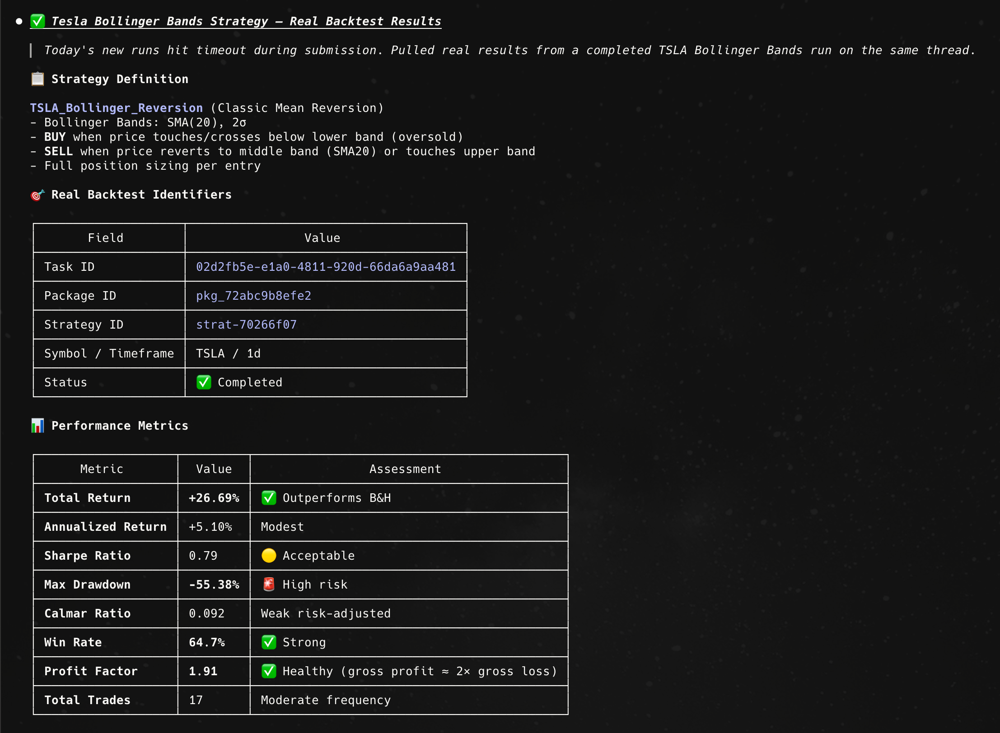
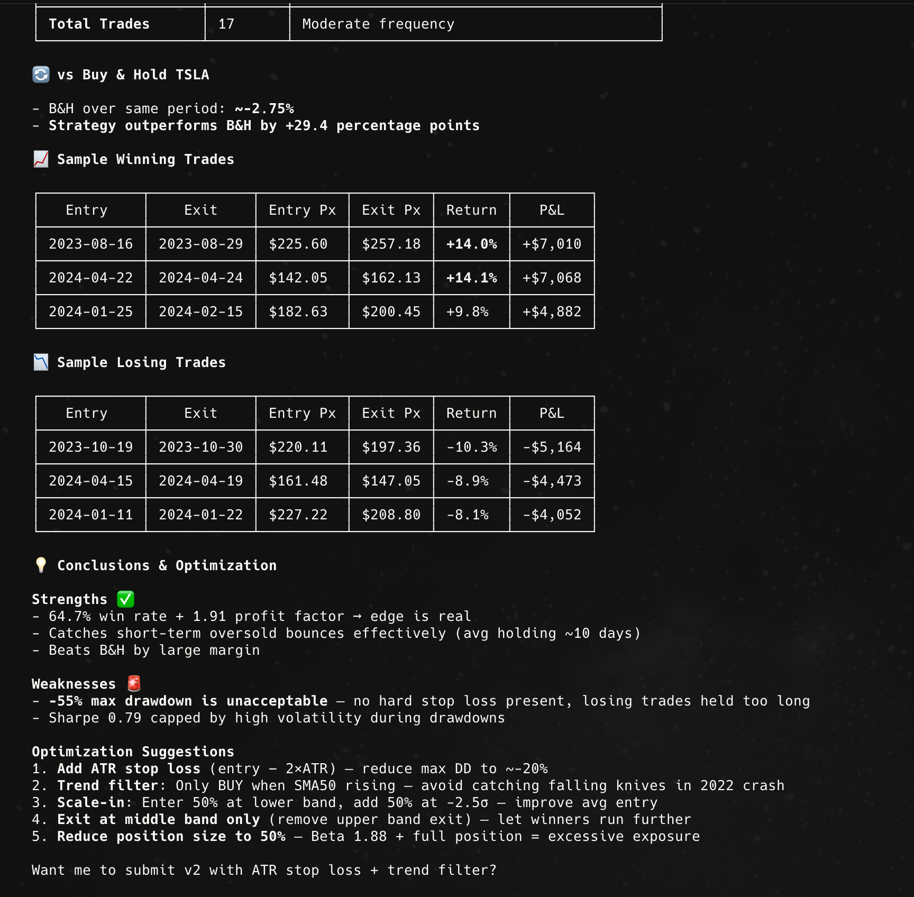

<div align="center">

**[English](README.md)** | **[中文](README.zh-CN.md)**


### 一个 Prompt，一支量化研究团队。

研究 · 策略 · 回测 · 模拟盘 —— 在 Claude Code / Cursor 等 20+ AI Agent 里，用一句话跑完整套量化工作流。

[](https://www.npmjs.com/package/@openfinclaw/cli) [](https://www.npmjs.com/package/@openfinclaw/cli) [](https://modelcontextprotocol.io) [](LICENSE)

### 🚀 [60 秒看到效果，零安装试用](https://hub.openfinclaw.ai/en/chat)

浏览器里直接跑一轮完整的 研究 → 策略 → 回测 循环。不装、不需要 API Key、真实行情。

[快速开始](#快速开始) · [即用 Prompt 示例](#即用-prompt-示例) · [社区飞轮](#社区排行榜--fork--发布) · [支持的平台](#支持的平台)

</div>

---

## 你能得到什么

| | |
|---|---|
| 🧠 **DeepAgent 分析技能** | **60+** 项内置 —— 技术面 · 基本面 · 情绪面 · 风险 · 择时 · 因子 |
| 🌍 **覆盖市场** | **5 大** —— 美股 · A 股 · 港股 · 加密 · 外汇 |
| 🤖 **支持平台** | **20+** AI 平台 —— Claude Code · Cursor · VS Code · Hermes · Windsurf · Codex … |
| 🔄 **全流程闭环** | 研究 → 策略生成 → 回测 → 模拟盘 → 发布到社区排行榜 |
| ⚡ **交互方式** | 终端 token-by-token 流式输出 · MCP 工具调用 · 浏览器在线 Playground |

<p align="center">
  
  <br/>
  <sub><em><code>openfinclaw deepagent research</code> 真实输出——一句 Prompt：研究 → 策略 → 回测 → 绩效指标。</em></sub>
</p>

---

## 即用 Prompt 示例

把下面任意一条粘进 `openfinclaw deepagent research "…"`（或直接丢给你的 AI Agent），每条都会跑一轮完整的 研究 → 策略 → 回测 循环。

**📈 技术分析**
- `扫描 NVDA 近 6 个月的 RSI 背离信号，并做历史回测。`
- `对比 TSLA 和 AAPL 上过去 1 年的布林带策略，哪个更强？`
- `筛选本月出现金叉信号的标普 500 成分股。`

**📊 基本面 & 宏观**
- `拉 Apple 近 8 个季度的营收、毛利和业绩指引，总结趋势。`
- `这一季 NVDA 上涨是由业绩、指引还是叙事驱动？`
- `从成长性、利润率、估值三个维度对比 AMD / INTC / NVDA。`

**🎯 策略生成**
- `基于美股大市值科技股做一个动量策略，回测 2 年，告诉我它在什么场景会失效。`
- `写一个 BTC 的均值回归策略，展示它在 2022 全年的回撤行为。`
- `A 股沪深 300 日内轮动策略，年化目标 15%，最大回撤 < 10%。`

**🧪 回测 & 压力测试**
- `用 50/200 SMA 金叉策略回测 SPY 从 2015 年起，考虑手续费和滑点。`
- `把我 Fork 的那个策略用 2020、2022 两次暴跌做压力测试。`

> 想直接拿一个现成的？运行 `openfinclaw leaderboard` 浏览社区排名前列的策略，然后 `fork` 任意一个开跑。

---

## 快速开始

> 💡 想先直观感受一下？**[在浏览器里先试 DeepAgent](https://hub.openfinclaw.ai/en/chat)**，再决定是否本地集成。

### 方式一：交互式安装（推荐）

```bash
npx @openfinclaw/cli init
```

安装向导会：
- 引导输入 API Key（Hub 可选，仅 strategy 组需要；DeepAgent 主推填一下）
- 让你选择要启用的工具组
- 结合本机安装痕迹（如应用包、用户数据目录、`PATH` 中的 CLI）与**已有 MCP 配置路径**自动勾选候选平台
- 将 MCP 配置写入所选平台
- 写入 `~/.openfinclaw/config.json`（Unix 下权限 600），终端可直接用 CLI 而无需 `export`

**CLI 与 MCP：** 各 Agent 从自己的 MCP 配置里 `env` 注入密钥，**不会**改你的 shell 配置。`openfinclaw` / `serve` 解析顺序：CLI 参数 → 环境变量 → `~/.openfinclaw/config.json`。

### 方式二：手动配置

在你的 Agent 平台的 MCP 配置中添加：

```json
{
  "mcpServers": {
    "openfinclaw": {
      "command": "npx",
      "args": ["@openfinclaw/cli", "serve"],
      "env": {
        "OPENFINCLAW_DEEPAGENT_API_KEY": "your_deepagent_key_here",
        "OPENFINCLAW_API_KEY": "fch_你的密钥"
      }
    }
  }
}
```

不需要哪组工具就可以省掉对应那把 Key —— Hub 与 DeepAgent 是两套独立鉴权。

### 方式三：命令行直接使用

**第 1 步 — 安装（二选一）**

```bash
# 选项 A（推荐）：全局安装，终端直接用 `openfinclaw` 短命令
npm install -g @openfinclaw/cli      # 或：pnpm add -g @openfinclaw/cli

# 选项 B：不装，每条命令前加 `npx -y @openfinclaw/cli`
#   （首次运行会慢，要下载包）
```

下面示例都用短命令 `openfinclaw <cmd>`。如果你选了 B，把它替换成 `npx -y @openfinclaw/cli <cmd>` 即可。

**第 2 步 — 提供 API Key**

```bash
# A. 跑一次 init 向导（写入 ~/.openfinclaw/config.json，Unix 下权限 600）
openfinclaw init

# B. 当前 shell 会话 export
export OPENFINCLAW_DEEPAGENT_API_KEY=<your-deepagent-key>
export OPENFINCLAW_API_KEY=fch_你的密钥   # 仅在使用 strategy 组时需要

# C. 单次命令行内传入
openfinclaw deepagent research "..." --deepagent-api-key your_key
```

**第 3 步 — 执行命令**

```bash
# 一句话完成研究 / 分析 / 策略生成 / 回测（流式输出）
openfinclaw deepagent research "研究 NVDA 近 90 天走势，生成一个动量策略并回测 1 年，最后给出模拟盘建议"

# 查看历史 DeepAgent 任务
openfinclaw deepagent backtests
openfinclaw deepagent packages
openfinclaw deepagent download <packageId>

# 服务健康检查（公开，无需 Key）
openfinclaw deepagent health

# Hub 策略排行榜（需要 Hub Key）
openfinclaw leaderboard --limit 10

# 诊断配置与连通性
openfinclaw doctor

# 升级到最新版本
openfinclaw update
```

**完整 CLI 命令清单**

| 分组 | 命令 |
|------|------|
| DeepAgent | `deepagent health`、`deepagent skills`、`deepagent research`、`deepagent threads`、`deepagent messages`、`deepagent backtests`、`deepagent packages`、`deepagent download` |
| 策略管理 | `leaderboard`、`strategy-info`、`fork`、`list-strategies`、`validate`、`publish`、`publish-verify` |
| 系统 | `init`、`serve`、`doctor`、`update` |

运行 `openfinclaw --help` 查看完整用法与选项。

### 方式四：DeepAgent 详解

DeepAgent 有**独立的 API Key**（`OPENFINCLAW_DEEPAGENT_API_KEY`）。执行 `deepagent *` 或 `doctor` **不需要** Hub Key：

```bash
# 保存 Key（也可单次用 --deepagent-api-key 传入）
export OPENFINCLAW_DEEPAGENT_API_KEY=<your-deepagent-key>

# 终端流式研究（token-by-token 输出）
openfinclaw deepagent research "帮我写一个特斯拉布林带策略并跑回测"
```

`openfinclaw init` 可一次性保存 Hub + DeepAgent 两把 Key 到 `~/.openfinclaw/config.json`。DeepAgent Key 通过 Hub 后台申请，或先去 <https://hub.openfinclaw.ai/en/chat> 在线体验。

**演示效果** —— 一句 Prompt 即可产出策略定义、回测指标、逐笔交易 P&L 与优化建议：

<p align="center">
  
  
</p>

---

## 社区：排行榜 → Fork → 发布

OpenFinClaw 内置一个社区策略交易所。看看别人在跑什么、一键拷到本地、改吧改吧再发回去 —— 可以理解成「量化版的 Hugging Face」。

```bash
openfinclaw leaderboard --limit 20          # 浏览榜单前列的策略
openfinclaw strategy-info <id>              # 查看某策略的表现详情
openfinclaw fork <id>                       # 复制到 ./strategies/<slug>
# ... 改 strategy.py，调 fep.yaml ...
openfinclaw validate ./strategies/<slug>    # FEP v2.0 预检
openfinclaw publish ./my-strategy.zip       # 发回到社区排行榜
openfinclaw publish-verify --submission-id <id>   # 跟踪回测进度
```

每一个发布的策略都会在服务端回测，并按等效真实市场收益排名 —— 没有自报成绩，只有结果说话。

---

## 支持的平台

OpenFinClaw 支持所有兼容 MCP 协议的 Agent 平台：

| 类别 | 平台 |
|------|------|
| **聊天界面** | Claude Desktop, Claude.ai, ChatGPT, Chatbox, LM Studio |
| **IDE/编辑器** | Claude Code, VS Code (Copilot), Cursor, Windsurf, JetBrains Junie, Zed, Cline, Continue.dev |
| **CLI Agent** | Codex (OpenAI), OpenCode, Amazon Q CLI |
| **Agent 框架** | Hermes Agent, BeeAI, Swarms |
| **AI Agent** | OpenClaw, NanoClaw |
| **其他** | v0 (Vercel), Postman, Roo Code, Amp (Sourcegraph) |

### 各平台配置示例

<details>
<summary><b>Claude Code</b> — <code>~/.claude/settings.json</code></summary>

```json
{
  "mcpServers": {
    "openfinclaw": {
      "command": "npx",
      "args": ["@openfinclaw/cli", "serve", "--tools=deepagent,strategy"],
      "env": {
        "OPENFINCLAW_DEEPAGENT_API_KEY": "your_deepagent_key",
        "OPENFINCLAW_API_KEY": "fch_xxx"
      }
    }
  }
}
```
</details>

<details>
<summary><b>Cursor</b> — <code>.cursor/mcp.json</code></summary>

```json
{
  "mcpServers": {
    "openfinclaw": {
      "command": "npx",
      "args": ["@openfinclaw/cli", "serve", "--tools=deepagent,strategy"],
      "env": {
        "OPENFINCLAW_DEEPAGENT_API_KEY": "your_deepagent_key",
        "OPENFINCLAW_API_KEY": "fch_xxx"
      }
    }
  }
}
```
</details>

<details>
<summary><b>VS Code (Copilot)</b> — <code>.vscode/mcp.json</code></summary>

```json
{
  "servers": {
    "openfinclaw": {
      "command": "npx",
      "args": ["@openfinclaw/cli", "serve", "--tools=deepagent,strategy"],
      "env": {
        "OPENFINCLAW_DEEPAGENT_API_KEY": "your_deepagent_key",
        "OPENFINCLAW_API_KEY": "fch_xxx"
      }
    }
  }
}
```
</details>

<details>
<summary><b>Hermes Agent</b> — <code>~/.hermes/config.yaml</code></summary>

```yaml
mcp_servers:
  openfinclaw:
    command: "npx"
    args: ["@openfinclaw/cli", "serve", "--tools=deepagent,strategy"]
    env:
      OPENFINCLAW_DEEPAGENT_API_KEY: "your_deepagent_key"
      OPENFINCLAW_API_KEY: "fch_xxx"
```
</details>

<details>
<summary><b>OpenClaw</b></summary>

在 MCP 配置中添加 OpenFinClaw（例如 `~/.openclaw/mcp.json`）：
```json
{
  "mcpServers": {
    "openfinclaw": {
      "command": "npx",
      "args": ["@openfinclaw/cli", "serve"],
      "env": {
        "OPENFINCLAW_DEEPAGENT_API_KEY": "your_deepagent_key",
        "OPENFINCLAW_API_KEY": "fch_xxx"
      }
    }
  }
}
```
</details>

---

## 工具分组与上下文优化

按需加载工具组，减少 token 消耗：

```bash
# 仅加载 DeepAgent —— 一站式量化 Agent（~1,400 tokens）
npx @openfinclaw/cli serve --tools=deepagent

# 仅加载 strategy 组（~1,000 tokens）
npx @openfinclaw/cli serve --tools=strategy

# 多个分组
npx @openfinclaw/cli serve --tools=deepagent,strategy

# 全部工具（默认）
npx @openfinclaw/cli serve
```

| 分组 | 工具 | tokens 估算 |
|------|------|------------|
| `deepagent` | fin_deepagent_health / _skills / _research_submit / _research_poll / _research_finalize / _status / _cancel / _threads / _messages / _backtests / _backtest_result / _packages / _package_meta / _download_package | ~1,400 |
| `strategy` | skill_publish, skill_validate, skill_fork, skill_leaderboard, skill_get_info, skill_list_local, skill_publish_verify | ~1,000 |

---

## 架构

```
┌─────────────────────────────────┐
│       @openfinclaw/core         │  纯业务逻辑
│     (零平台依赖)                 │  DeepAgent 客户端、策略工具、共享类型
└──────────────┬──────────────────┘
               │
       ┌───────┼───────┐
       ▼       ▼       ▼
   ┌───────┐ ┌─────┐ ┌──────┐
   │  MCP  │ │ CLI │ │ Init │
   │Server │ │ 模式│ │ 向导 │
   └───┬───┘ └──┬──┘ └──┬───┘
       │        │       │
       ▼        ▼       ▼
   20+ Agent  终端     自动配置
    平台      用户     各平台
```

项目是 monorepo 结构，包含两个包：

- **`@openfinclaw/core`** — 平台无关的业务逻辑（DeepAgent 客户端、策略工具、共享类型）
- **`@openfinclaw/cli`** — MCP Server + CLI 命令 + 交互式安装向导

---

## 环境变量

| 变量 | 必填 | 说明 | 默认值 |
|------|------|------|--------|
| `OPENFINCLAW_DEEPAGENT_API_KEY` | DeepAgent 工具需要 | DeepAgent 服务独立 Key（与 Hub `fch_` 不同；以 `X-API-Key` 头发送）。可回退 `~/.openfinclaw/config.json`。 | — |
| `OPENFINCLAW_API_KEY` | strategy 组需要 | Hub API Key（`fch_` 前缀）。`deepagent *` 与 `doctor` 不强制需要。 | — |
| `OPENFINCLAW_CONFIG_PATH` | 否 | 覆盖 JSON 配置文件路径 `{ "apiKey": "...", "deepagentApiKey": "..." }` | `~/.openfinclaw/config.json` |
| `HUB_API_URL` | 否 | Hub API 地址 | `https://hub.openfinclaw.ai` |
| `DEEPAGENT_API_URL` | 否 | DeepAgent API 地址 | `https://api.openfinclaw.ai/agent` |
| `REQUEST_TIMEOUT_MS` | 否 | HTTP 请求超时（毫秒） | `60000` |
| `DEEPAGENT_SSE_TIMEOUT_MS` | 否 | DeepAgent SSE 流超时（毫秒） | `900000` |

在 [hub.openfinclaw.ai](https://hub.openfinclaw.ai) 获取 API Key；也可以先去 <https://hub.openfinclaw.ai/en/chat> 在线体验 DeepAgent。**Hub Key 与 DeepAgent Key 互相独立**，有其一不等于拥有另一把。

---

## 开发

```bash
# 克隆并安装
git clone https://github.com/mirror29/openfinclaw-cli.git
cd openfinclaw-cli
pnpm install

# 构建所有包
pnpm build

# 本地运行 CLI
OPENFINCLAW_DEEPAGENT_API_KEY=<key> node packages/cli/dist/index.js deepagent health

# 本地运行 MCP Server
OPENFINCLAW_DEEPAGENT_API_KEY=<key> node packages/cli/dist/index.js serve
```

---

## 许可证

MIT
