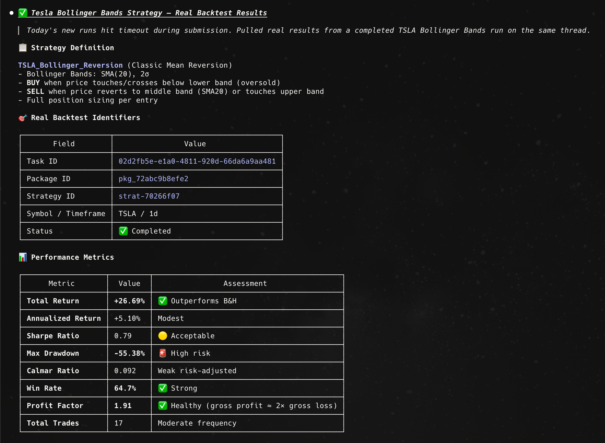
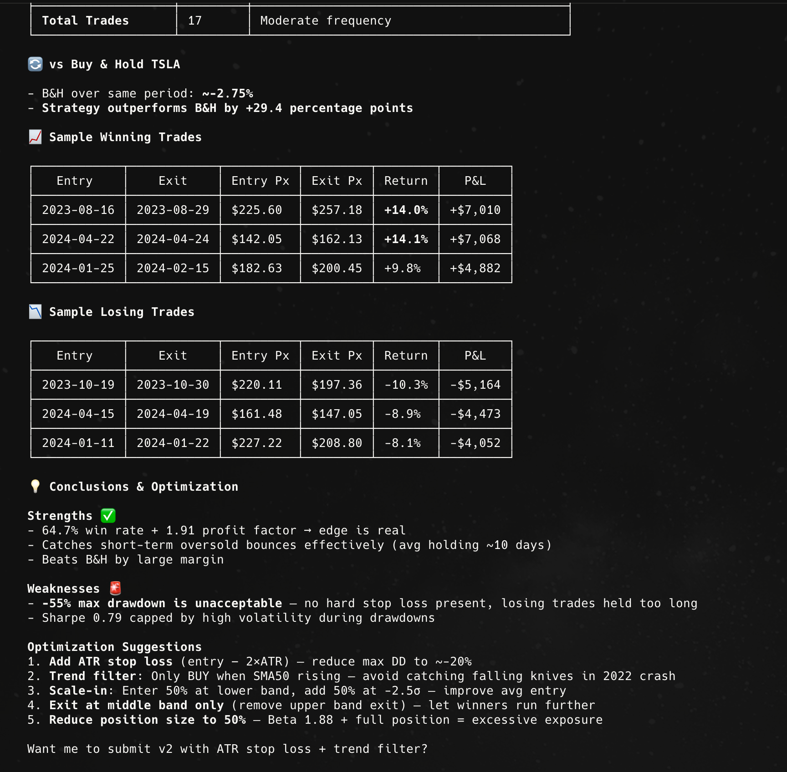

<div align="center">

**[English](README.md)** | **[中文](README.zh-CN.md)**


### 一个 Prompt，一支量化研究团队。

研究 · 策略 · 回测 · 模拟盘 —— 在 Claude Code / Cursor 等 20+ AI Agent 里，用一句话跑完整套量化工作流。

[](https://www.npmjs.com/package/@openfinclaw/cli) [](https://www.npmjs.com/package/@openfinclaw/cli) [](https://modelcontextprotocol.io) [](LICENSE)

### 🚀 [60 秒看到效果，零安装试用](https://hub.openfinclaw.ai/en/chat)

浏览器里直接跑一轮完整的 研究 → 策略 → 回测 循环。不装、不需要 API Key、真实行情。

[快速开始](#快速开始) · [即用 Prompt 示例](#即用-prompt-示例) · [社区飞轮](#社区排行榜--fork--发布) · [支持的平台](#支持的平台) · [与其它工具对比](COMPARISON.zh-CN.md)

</div>

---

## 你能得到什么

| | |
|---|---|
| 🧠 **DeepAgent 分析技能** | **60+** 项内置 —— 技术面 · 基本面 · 情绪面 · 风险 · 择时 · 因子 |
| 🌍 **覆盖市场** | **5 大** —— 美股 · A 股 · 港股 · 加密 · 外汇 |
| 🤖 **支持平台** | **20+** AI 平台 —— Claude Code · Cursor · VS Code · Hermes · Windsurf · Codex … |
| 🔄 **全流程闭环** | 研究 → 策略生成 → 回测 → 模拟盘 → 发布到社区排行榜 |
| ⚡ **交互方式** | 终端 token-by-token 流式输出 · MCP 工具调用 · 浏览器在线 Playground |

<p align="center">
  
  <br/>
  <sub><em><code>openfinclaw deepagent research</code> 真实输出——一句 Prompt：研究 → 策略 → 回测 → 绩效指标。</em></sub>
</p>

---

## 即用 Prompt 示例

把下面任意一条粘进 `openfinclaw deepagent research "…"`（或直接丢给你的 AI Agent），每条都会跑一轮完整的 研究 → 策略 → 回测 循环。

**📈 技术分析**
- `扫描 NVDA 近 6 个月的 RSI 背离信号，并做历史回测。`
- `对比 TSLA 和 AAPL 上过去 1 年的布林带策略，哪个更强？`
- `筛选本月出现金叉信号的标普 500 成分股。`

**📊 基本面 & 宏观**
- `拉 Apple 近 8 个季度的营收、毛利和业绩指引，总结趋势。`
- `这一季 NVDA 上涨是由业绩、指引还是叙事驱动？`
- `从成长性、利润率、估值三个维度对比 AMD / INTC / NVDA。`

**🎯 策略生成**
- `基于美股大市值科技股做一个动量策略，回测 2 年，告诉我它在什么场景会失效。`
- `写一个 BTC 的均值回归策略，展示它在 2022 全年的回撤行为。`
- `A 股沪深 300 日内轮动策略，年化目标 15%，最大回撤 < 10%。`

**🧪 回测 & 压力测试**
- `用 50/200 SMA 金叉策略回测 SPY 从 2015 年起，考虑手续费和滑点。`
- `把我 Fork 的那个策略用 2020、2022 两次暴跌做压力测试。`

> 想直接拿一个现成的？运行 `openfinclaw leaderboard` 浏览社区排名前列的策略，然后 `fork` 任意一个开跑。

---

## 快速开始

> 💡 想先直观感受一下？**[在浏览器里先试 DeepAgent](https://hub.openfinclaw.ai/en/chat)**，再决定是否本地集成。

### 60 秒上手

```bash
npx @openfinclaw/cli@latest install               # 向导 + MCP 配置 + Skill 注册 + doctor 一气呵成
openfinclaw deepagent +research "盘点 BTC 周线"     # 立刻流式跑一轮研究 / 策略 / 回测
```

`install` 一行命令做完：交互式向导、给所有探测到的 AI Agent 写 MCP 配置、把 `fch_` Key 持久化到 `~/.openfinclaw/config.json`（Unix 下 chmod 600）、把 SKILL.md 放进 `~/.claude/skills/openfinclaw/`（Claude Code / Cursor 见到 `quant` / `backtest` / `量化` 等关键词自动触发）、末尾跑一次连通性检查。

非交互 / CI 场景：

```bash
npx @openfinclaw/cli@latest install --yes \
  --platforms cursor,claude-code --tool-groups deepagent,strategy \
  --api-key fch_xxx --register-skill
```

只跑向导、不注册 SKILL.md、不跑 doctor：`npx @openfinclaw/cli init`。

### CLI 速查

一把 `fch_` Key 同时驱动 DeepAgent 与 strategy 工具组。解析顺序：`--api-key` → `OPENFINCLAW_API_KEY` → `~/.openfinclaw/config.json`。

| 分组 | 命令 |
|------|------|
| DeepAgent | `deepagent +research "<查询>"`、`deepagent health`、`deepagent skills`、`deepagent threads`、`deepagent messages`、`deepagent backtests`、`deepagent packages`、`deepagent download` |
| 策略管理 | `leaderboard`、`strategy-info`、`fork`、`list-strategies`、`validate`、`publish`、`publish-verify` |
| Raw 通道 | `api GET <path>` · `api POST <path> --json '<body>'` —— 直打 Hub Gateway，鉴权自动附加 |
| 系统 | `install` · `init` · `skill-install` · `serve` · `doctor` · `update` · `examples` |

`+verb`（例如 `deepagent +research`）走人类友好的流式渲染；不带 `+` 的原子动词以及 MCP 专用三件套 `research_submit / research_poll / research_finalize` 留给 Agent / 脚本调用。完整用法见 `openfinclaw --help`。

**DeepAgent 演示效果** —— 一句 Prompt 即可产出策略定义、回测指标、逐笔交易 P&L 与优化建议：

<p align="center">
  
  
</p>

---

## 社区：排行榜 → Fork → 发布

OpenFinClaw 内置一个社区策略交易所。看看别人在跑什么、一键拷到本地、改吧改吧再发回去 —— 可以理解成「量化版的 Hugging Face」。

```bash
openfinclaw leaderboard --limit 20          # 浏览榜单前列的策略
openfinclaw strategy-info <id>              # 查看某策略的表现详情
openfinclaw fork <id>                       # 复制到 ./strategies/<slug>
# ... 改 strategy.py，调 fep.yaml ...
openfinclaw validate ./strategies/<slug>    # FEP v2.0 预检
openfinclaw publish ./my-strategy.zip       # 发回到社区排行榜
openfinclaw publish-verify --submission-id <id>   # 跟踪回测进度
```

每一个发布的策略都会在服务端回测，并按等效真实市场收益排名 —— 没有自报成绩，只有结果说话。

---

## 支持的平台

OpenFinClaw 支持所有兼容 MCP 协议的 Agent 平台：

| 类别 | 平台 |
|------|------|
| **聊天界面** | Claude Desktop, Claude.ai, ChatGPT, Chatbox, LM Studio |
| **IDE/编辑器** | Claude Code, VS Code (Copilot), Cursor, Windsurf, JetBrains Junie, Zed, Cline, Continue.dev |
| **CLI Agent** | Codex (OpenAI), OpenCode, Amazon Q CLI |
| **Agent 框架** | Hermes Agent, BeeAI, Swarms |
| **AI Agent** | OpenClaw, NanoClaw |
| **其他** | v0 (Vercel), Postman, Roo Code, Amp (Sourcegraph) |

### 各平台配置示例

<details>
<summary><b>Claude Code</b> — <code>~/.claude/settings.json</code></summary>

```json
{
  "mcpServers": {
    "openfinclaw": {
      "command": "npx",
      "args": ["@openfinclaw/cli", "serve", "--tools=deepagent,strategy"],
      "env": {
        "OPENFINCLAW_API_KEY": "fch_xxx"
      }
    }
  }
}
```
</details>

<details>
<summary><b>Cursor</b> — <code>.cursor/mcp.json</code></summary>

```json
{
  "mcpServers": {
    "openfinclaw": {
      "command": "npx",
      "args": ["@openfinclaw/cli", "serve", "--tools=deepagent,strategy"],
      "env": {
        "OPENFINCLAW_API_KEY": "fch_xxx"
      }
    }
  }
}
```
</details>

其他平台（VS Code、Hermes、Windsurf、Zed、OpenClaw、Junie、Trae 等），见 [`configs/`](configs/) 现成模板。结构基本一致，差异主要在配置文件路径与外层 key（`servers` vs `mcpServers` vs `context_servers`）。

---

## 工具分组与上下文优化

按需加载省 token：`serve --tools=deepagent`（~1,400 tk）或 `serve --tools=strategy`（~1,000 tk），不传 `--tools=` 则全部加载。

| 分组 | 工具 |
|------|------|
| `deepagent` | 14 个远端 Agent 工具 —— `fin_deepagent_health` / `_skills` / `_research_submit` / `_research_poll` / `_research_finalize` / `_status` / `_cancel` / `_threads` / `_messages` / `_backtests` / `_backtest_result` / `_packages` / `_package_meta` / `_download_package` |
| `strategy` | 7 个本地 FEP v2.0 工具 —— `strategy_publish` / `strategy_validate` / `strategy_fork` / `strategy_leaderboard` / `strategy_get_info` / `strategy_list_local` / `strategy_publish_verify` |

---

## 环境变量

只有一个必填：

| 变量 | 说明 |
|------|------|
| `OPENFINCLAW_API_KEY` | 统一 `fch_` Key，同时驱动 strategy（Hub）与 deepagent（Hub Gateway）。未设时回退 `~/.openfinclaw/config.json`。在 [hub.openfinclaw.ai](https://hub.openfinclaw.ai) 申请。 |

其余高级覆盖（基本不需要动）：`OPENFINCLAW_CONFIG_PATH`、`HUB_API_URL`、`DEEPAGENT_API_URL`、`REQUEST_TIMEOUT_MS`、`DEEPAGENT_SSE_TIMEOUT_MS`，详见 `packages/core/src/config.ts`。

---

## 开发

```bash
git clone https://github.com/mirror29/openfinclaw-cli.git && cd openfinclaw-cli && pnpm install && pnpm build
OPENFINCLAW_API_KEY=<fch_...> node packages/cli/dist/index.js doctor   # smoke 测试
```

Monorepo：`@openfinclaw/core`（零依赖业务逻辑）+ `@openfinclaw/cli`（MCP Server + 终端 CLI + 安装向导）。

---

## 许可证

MIT
